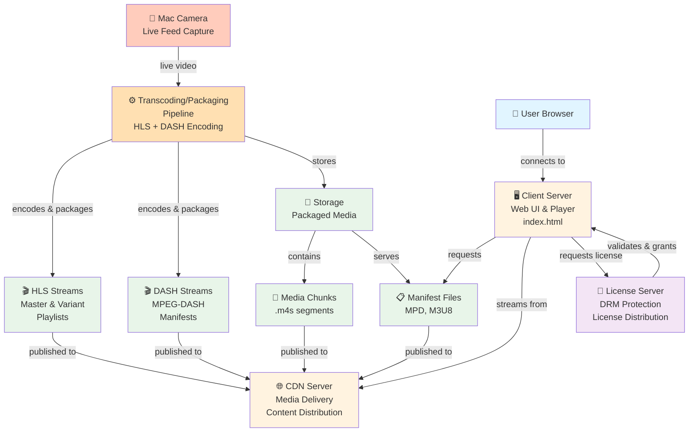

# DRM Demo Architecture

## Component Diagram

## Component Descriptions

### Input & Processing
| Component | Purpose | Role |
|-----------|---------|------|
| **Mac Camera** | Live video capture | Source of streaming content |
| **Transcoding/Packaging Pipeline** | Encodes and segments video | Converts live feed into HLS and DASH formats |

### Three Main Servers
| Component | Purpose | Responsibility |
|-----------|---------|-----------------|
| **Client Server** | Web interface and player | Serves index.html, hosts player UI, requests content |
| **License Server** | DRM protection | Issues and validates licenses, ensures content protection |
| **CDN Server** | Content distribution | Delivers media chunks and manifests to clients |

### Media Assets
| Component | Purpose | Format |
|-----------|---------|--------|
| **Manifest Files** | Stream metadata | M3U8 (HLS) and MPD (DASH) |
| **HLS Streams** | Adaptive streaming | HTTP Live Streaming protocol with variant playlists |
| **DASH Streams** | Adaptive streaming | MPEG-DASH protocol with period-based organization |
| **Media Chunks** | Video/audio segments | ISO Base Media File Format (.m4s files) |

## Data Flow

1. **Live Capture**: Mac camera captures live video feed
2. **Transcoding**: Pipeline encodes video to multiple bitrates
3. **Packaging**: Video segmented into HLS and DASH formats with manifests
4. **Storage**: Packaged content stored for delivery
5. **Distribution**: CDN server distributes manifest and chunk files
6. **Client Request**: User browser loads Client Server (index.html)
7. **License Validation**: Client requests license from License Server
8. **Streaming**: Licensed client downloads chunks from CDN and plays content

## Architecture Overview

- **Source**: Mac camera provides live video input
- **Processing**: Transcoding/Packaging pipeline creates HLS and DASH streams
- **Distribution**: Three-server architecture handles different responsibilities:
  - **Client Server**: Serves web player interface
  - **License Server**: Manages DRM and content access control
  - **CDN Server**: Streams media content to authorized clients
- **Playback**: Licensed user streams adaptive bitrate content through web player
